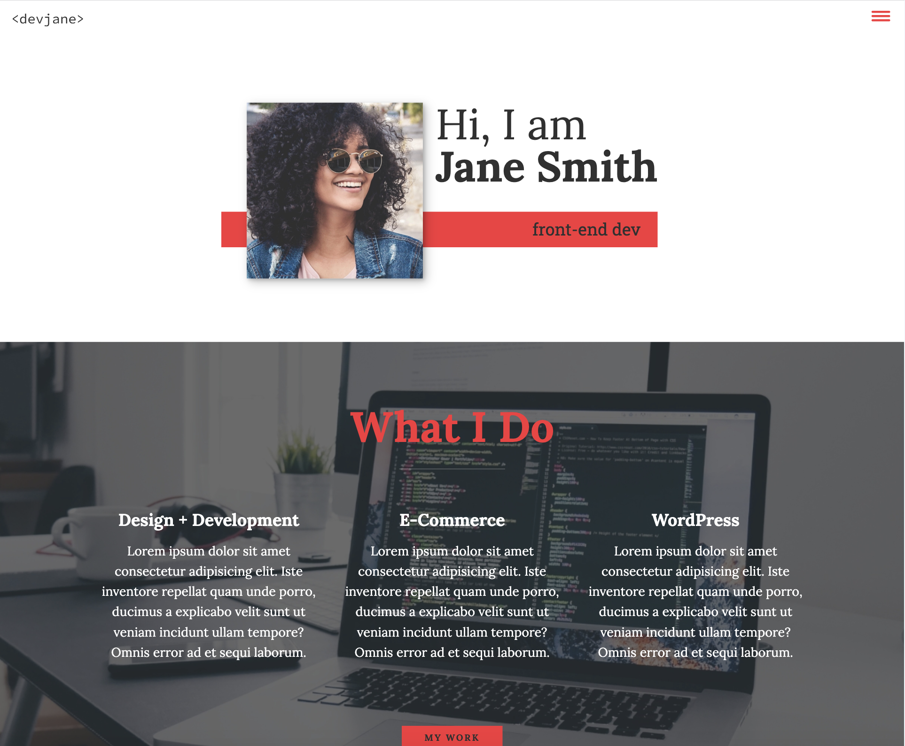

# Jane's Portfolio Website 🙋‍♀️

**Live Preview: [Click Me](https://janes-portfolio-website.netlify.app)**

---

**A HTML CSS JS Project**. Made as a practice project. The idea was taken from web development community  

## What I learned:

- HTML, CSS and a bit of JavaScript
- Hamburger Interactive Menu
- CSS Grid and Flexbox
- Netlify Deployment
- And more . . .

## Tools Used

- Code Editor: VS Code